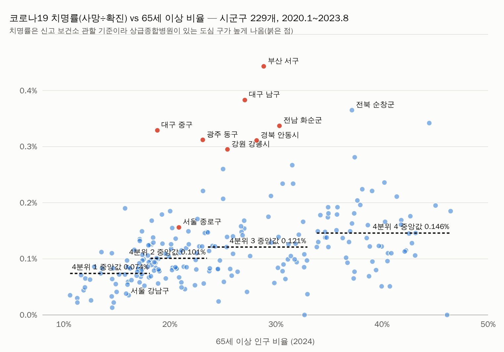

# 코로나19 시군구별 사망률 비교 — 고위험군 카드 검증용 (v1, 2026-09-23)

소유자 질문: "지자체별로 코로나19 때 연령별 감염자 수나 참고로 비교할 만한 데이터가 있을까?" → 받아지면 시군구별 사망률을 비교해 보고.

## 1. 쓸 수 있는 자료와 없는 자료

| 자료 | 단위 | 연령 | 기간 | 판단 |
|---|---|---|---|---|
| 질병관리청 「코로나19 시군구별 월별 확진자 및 사망 발생 현황」(공공데이터포털 15124288) | **시군구** × 월 | 없음 | 2020-01-20 ~ 2023-08-31 (전수감시 종료) | **이번에 사용** |
| 질병관리청 「코로나19 확진자 발생현황(전수감시)」(15127820) | 연령별은 전국만 · 지역은 시도·시군구 합계 | 전국만 | 같음 | 연령 참고선용 |
| 질병관리청 「코로나19 예방접종 통계 현황」(15131145) | 시도 × 연령군 4개 × 1~3차 | 시도만 | 2021-02 ~ 2023-10 | 시군구 없음 |
| 사망원인통계 코로나19(U07.1) | 시도 × 연령 | 시도만 | 2020~2024 | 시군구 없음 |
| 서울 열린데이터광장 자치구별 확진자·사망자 | 자치구 | 없음(개인정보 지침) | 같음 | 위 1과 중복 |

**결론: 「지자체별 × 연령별」 감염자·사망자는 어디에도 공표되지 않았다.** 시군구 단위는 확진·사망 합계뿐이고, 연령별은 전국 단위뿐이다.

## 2. 처리

`scripts/build_covid.py <xlsx>` → `data/covid_sgg.json`. 원자료 xlsx(148KB)는 `data/raw_covid/`(gitignore)에 보관.
- 시트 「확진자」·「사망자」의 연도별 「전체」 열을 더해 2020~2023.8 누적. '-'는 0.
- 일반구(고양시 덕양구 등)는 시로 합산, 「합계」 행은 시도 값, 「검역」(확진 2,441 · 사망 2)은 제외.
- 분모 인구는 고위험군 카드와 같은 **2024년 연앙인구**(data/risk.json). 유행기와 연도가 달라 근사.
- 결과: 시도 17 · 시군구 231(인구 있는 229) 매칭.

**합계 검증** — 시도 합 확진 34,279,568 · 사망 34,961 · 치명률 0.102%. 질병관리청 최종 집계(2023-08-31, 확진 약 3,457만 · 사망 35,934)보다 확진 0.8%, 사망 2.7% 적다. 파일이 「신고 보건소 관할」 기준 집계라 검역·주소 불명 등이 빠진 것으로 보이며, 비교 목적에는 지장이 없는 차이.

## 3. 결과

시군구 229개 중앙값: **누적 확진율 64.8%(인구 100명당) · 인구 10만 명당 사망 65.8명 · 치명률 0.107%**.

### 3.1 고위험군이 많을수록 치명률이 높다 — 그러나 사망률(인구당)은 약하게만

65세 이상 비율 4분위별 중앙값:

| 65세 이상 비율 | 확진율 | 10만 명당 사망 | **치명률** |
|---|---|---|---|
| 1분위 10.6~18.1% (도시) | 69.9% | 53.2 | **0.074%** |
| 2분위 18.2~23.5% | 66.7% | 66.8 | 0.101% |
| 3분위 23.6~33.0% | 64.6% | 73.6 | 0.121% |
| 4분위 33.9~46.5% (군) | 52.5% | 74.1 | **0.146%** |

고령 비율 최상위 군 지역은 최하위 도시 지역보다 **확진율은 낮고(52 vs 70%), 치명률은 2배**다. 고위험군 카드의 「65세 이상 비율」이 감염 시 위험을 실제로 반영한다는 뜻이다.

스피어만 순위상관(시군구 229):

| 고위험군 지표(카드) | vs 10만 명당 사망 | vs 치명률 | vs 확진율 |
|---|---|---|---|
| 65세 이상 비율 | 0.29 | **0.49** | −0.67 |
| 75세 이상 비율 | 0.29 | 0.48 | −0.65 |
| 독거노인 비율 | 0.31 | **0.51** | −0.65 |
| 고혈압 진단경험자 비율(추정) | 0.23 | 0.43 | −0.66 |
| 장기요양 시설 정원(천 명당) | 0.22 | 0.36 | −0.47 |
| 의사 수(10만 명당) | 0.30 | 0.10 | +0.58 |

읽는 법 — 고령·독거·기저질환 비율은 치명률과 중간 정도(0.4~0.5) 상관이 있다. 인구당 사망과는 약하다(0.2~0.3). 이유는 고령 지역이 **덜 감염됐기** 때문(확진율과 −0.65): 인구 밀도가 낮고 이동이 적어 감염 자체가 적었고, 걸리면 더 많이 죽었다. 의사 수는 확진율과 +0.58인데 이는 병원이 많은 도심에 검사·신고가 몰린 결과다(아래 3.3).

### 3.2 시도

| 시도 | 확진율 | 10만 명당 사망 | 치명률 | 65세+ |
|---|---|---|---|---|
| 서울 | 72.7 | 70.0 | 0.096 | 18.9 |
| 부산 | 64.1 | 88.5 | 0.138 | 23.3 |
| 대구 | 64.2 | 79.1 | 0.123 | 20.3 |
| 인천 | 66.5 | 64.9 | 0.098 | 17.1 |
| 광주 | 72.3 | 61.7 | 0.085 | 17.0 |
| 대전 | 70.6 | 69.9 | 0.099 | 17.5 |
| 울산 | 67.3 | 47.4 | 0.070 | 16.6 |
| 세종 | 35.3 | 7.6 | 0.022 | 11.3 |
| 경기 | 68.1 | 61.6 | 0.090 | 16.1 |
| 강원 | 66.3 | 92.5 | 0.139 | 24.7 |
| 충북 | 67.7 | 67.6 | 0.100 | 21.4 |
| 충남 | 65.4 | 76.3 | 0.117 | 21.8 |
| 전북 | 67.1 | 72.8 | 0.109 | 24.7 |
| 전남 | 63.7 | 60.5 | 0.095 | 26.7 |
| 경북 | 62.4 | 83.7 | 0.134 | 25.4 |
| 경남 | 64.3 | 65.0 | 0.101 | 21.2 |
| 제주 | 67.5 | 47.7 | 0.071 | 18.4 |

사망률 상위는 강원(92.5)·부산(88.5)·경북(83.7)·대구(79.1) — 고령 비율이 높거나(강원·경북) 2020년 초 대유행지(대구)·초기 요양병원 집단감염지(부산). 세종은 확진율 35%·사망 7.6으로 비정상적으로 낮아 **세종 주민의 검사·신고가 상당 부분 대전 등 인접 보건소로 잡힌 것**으로 보인다(3.3).

### 3.3 가장 중요한 주의 — 「거주지」가 아니라 「신고 보건소 관할」 기준이다

인구 10만 명당 사망 상위 10개 시군구:

| 시군구 | 사망 | 10만 명당 | 치명률 | 확진율 | 65세+ | 소재 대형병원 |
|---|---|---|---|---|---|---|
| 부산 서구 | 351 | **340.4** | 0.44% | 76.8% | 28.9% | 부산대병원·동아대병원 |
| 대구 남구 | 385 | 281.4 | 0.38% | 73.4% | 27.1% | 영남대병원·대구가톨릭대병원 |
| 광주 동구 | 256 | 241.5 | 0.31% | 77.4% | 23.1% | 전남대병원·조선대병원 |
| 전남 화순군 | 137 | 225.2 | 0.34% | 66.9% | 30.3% | 화순전남대병원 |
| 대구 중구 | 207 | 223.1 | 0.33% | 67.8% | 18.8% | 경북대병원·계명대 동산병원 |
| 경북 안동시 | 307 | 201.0 | 0.31% | 64.5% | 28.2% | 안동병원(권역) |
| 강원 강릉시 | 410 | 197.2 | 0.29% | 66.9% | 25.4% | 강릉아산병원 |
| 전북 순창군 | 51 | 190.7 | 0.36% | 52.3% | 37.2% | (고령 군) |
| 충북 영동군 | 72 | 164.6 | 0.28% | 58.6% | 37.4% | (고령 군) |
| 서울 종로구 | 225 | 164.1 | 0.16% | 104.9% | 20.9% | 서울대병원 |

상위 10곳 중 8곳이 **권역 상급종합병원 소재지**다. 사망이 사망 장소(병원)를 관할하는 보건소로 신고·집계됐다는 뜻이며, 거주지 기준이 아니다. 확진자도 마찬가지다 — 서울 중구 확진율 141%, 종로구 105%는 주민보다 직장인·검사소 이용자가 많이 잡힌 결과다. 반대로 세종(35%)·군위군(2.2%)은 인접 지역으로 빠져나갔다.

따라서 **이 자료로 시군구 사망률을 1등부터 줄 세우면 안 된다.** 「부산 서구가 코로나에 가장 취약했다」가 아니라 「부산 서구에서 가장 많이 사망 신고됐다」이다. 시도 단위·4분위 단위처럼 뭉뚱그리면 병원 효과가 희석되어 3.1 같은 비교가 가능하지만, 개별 시군구 값은 참고치로만 써야 한다.

### 3.4 서울 25개 구

10만 명당 사망 상위: 종로 164(서울대병원) · 동대문 127(경희대병원) · 서대문 122(세브란스) · 구로 103(고대구로병원) — 역시 병원 소재지. 하위: 마포 27 · 관악 44 · 서초 48 · 강남 51. 강남구는 65세 이상 16.1%로 서울 최저이고 사망률도 하위권이라 고위험군 카드와 방향이 맞다.

## 4. 고위험군 카드에 붙일지에 대한 의견

**붙일 수 있지만 개별 순위가 아니라 「참고 실적」으로만.** 제안:

1. 카드 하단에 「코로나19 실적(2020.1~2023.8, 신고 보건소 관할 기준)」 한 줄: 누적 확진율·10만 명당 사망·치명률과 **시도 값**·전국 중앙값. 시군구 순위는 표시하지 않음.
2. 병원 효과 경고문 필수: "사망은 사망 장소 관할 보건소로 집계되므로 대형병원이 있는 지역이 높게 나옵니다."
3. 65세 이상 비율 4분위별 치명률 표(0.074 → 0.146%)를 「고위험군 비율이 왜 중요한가」의 근거로 카드 설명에 인용.

붙이지 않기로 해도 이 문서와 `data/covid_sgg.json`은 남긴다.

## 5. 남은 것

- 예방접종 통계(시도 × 연령군)는 내려받는 중(공공데이터포털 연결 끊김 재시도). 받으면 시도 65세 이상 3차 접종률 vs 치명률을 3.2 표에 한 열 추가.
- 거주지 기준 시군구 사망은 사망원인통계 마이크로데이터(MDIS) 신청 사안. 연령별 시군구는 어디에도 없음.
